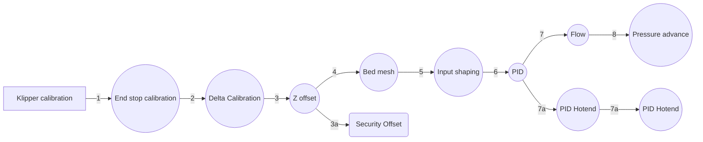

# FLSUN-SR-Klipper
Flsun SR Klipper with Raspberry Pi

```mermaid
graph LR
A[Klipper calibration] 
-- 1 --> B((End stop calibration))
-- 2 --> C((Delta Calibration))
-- 3 --> D((Z offset))
-- 4 --> E((Bed mesh))
-- 5 --> F((Input shaping))
-- 6 --> X((PID))
-- 7 --> I((Flow))
-- 8 --> L((Pressure advance))
X -- 7a --> W((PID Hotend))
 -- 7a --> Z((PID Hotend))
D --3a --> M(Security Offset)

```
